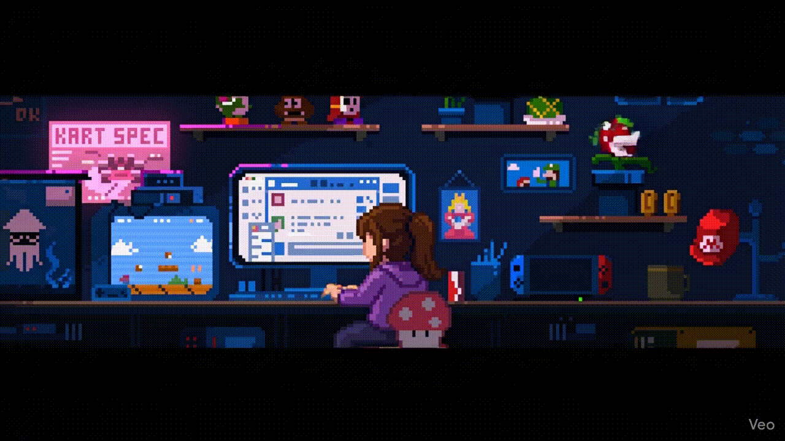

<!-- Header -->
<h1 align="center">Hi, I'm Samridhi!</h1>
<h3 align="center">Full-Stack Developer @ Deloitte USI | React • Next.js • Node.js • Java</h3>

  

---

### 🚀 About Me  
- 🔭 Full-stack engineer building **e-commerce apps** and **3D interactive websites** using Three.js / R3F.  
- 👩‍💻 Supporting projects **end-to-end as a solo developer** — frontend, backend, testing, deployments, pipelines, debugging, production support.  
- 🎨 Passionate about high-quality UI and component systems using **Tailwind, shadcn, daisyUI**.  
- 🧩 Love participating in **hackathons**, and have won a few as well!  
- ⚡ Fun fact: I fix production issues faster than I fix my sleep schedule 😄  

---

# 🧰 Tech Stack

## 🚀 Languages

  
  

## ⚙️ Backend

  
  
  
  

## 🎨 Frontend

  
  
  
  
  

## 🛠️ DevOps & Tools

  
  
  

---

# 📊 GitHub Stats

  
  

---

# 🏗️ Featured Projects

### 🎥 **1. Video Calling App (Socket.io + WebRTC)**  
Real-time video calling with rooms, WebRTC media streams, and live signaling.

### 🛹 **2. 3D Skateboard Configurator (Three.js / R3F)**  
Fully interactive 3D skateboard builder with textures, materials, lighting, and animations.

---

# 👩🏻‍💻 Development Zone  

---

# 📬 Connect With Me  

  
  

---

⭐ *If you like my work, consider leaving a star on my repositories!*
